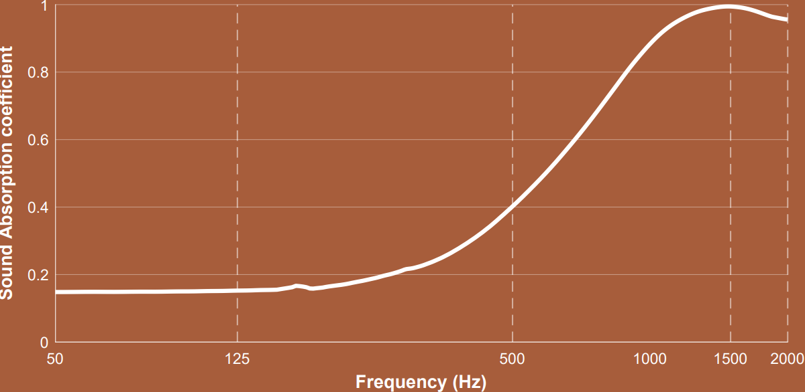
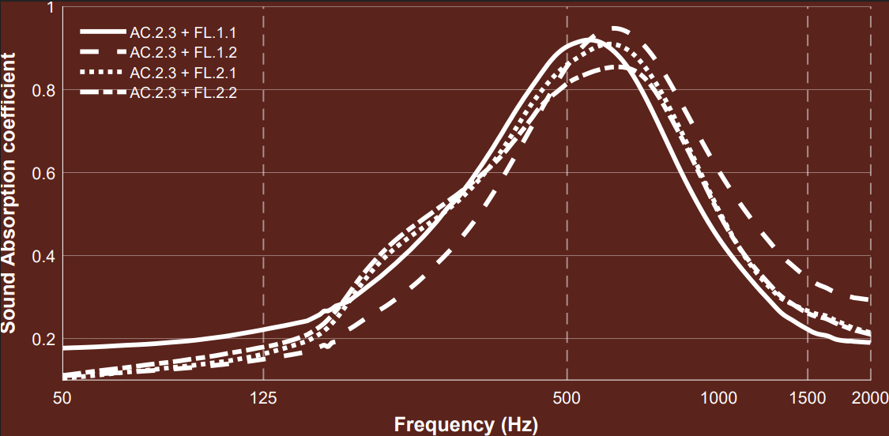

# impedance-tube-data-processing
MATLAB tools for extracting, processing and plotting of sound absorption coefficient curves from two-microphone impedance tube experiments. Follows ISO 10534-2.

## Overview
This repository provides an automated workflow for calculating acoustic properties from raw experimental data. The toolset is built around three core scripts:
* **'data_extractor.m'**: This is the data processing script. It utilizes the Transfer Function Method to determine the absorption coefficient.\
It takes two impedance tube tests, with the same sample but reversed microphone positions (i.e. microphone 1 is in position 1 for test 1, but is in position 2 for test 2), such that it can use those two tests to filter out sensor amplitude and phase mismatch (in the case that correction=true).

* **'impedance_tube_auto_plotter.m'**: This is a batch processing script. It scans the repository for all folders and will generate the standalone absorbance vs. frequency plot for every experimnent. This is very convenient for processing a large number of experiments present.
  
  

* **'Compound_plotter.m'**: This is a visualization tool for comparative analysis. It processes selected experiments and plots their absorption curves in one figure.
  
  

  
## Requirements
* **MATLAB 2024a** (or newer)
* **Signal Processing Toolbox** (required for `tfestimate`)
  
## Usage
To use the two automation scripts, ensure your data is organized into folders, with one folder corresponding to one experiment. Each folder contain must the two measurement files for the same sample, but with microphone 1 and 2 in reversed positions:
```text
📁 repository_root/
├── 📄 data_extractor.m
├── 📄 impedance_tube_auto_plotter.m
├── 📄 Compound_plotter.m
├── 📁 Experiment_01/
│   ├── 📄 test1_pos1.txt
│   └── 📄 test1_pos2.txt
└── 📁 Experiment_02/
```
Once your folders are structured, running `impedance_tube_auto_plotter.m` or `Compound_plotter.m` will generate the desired figures. `impedance_tube_auto_plotter.m` will automatically save the standalone plots in their respective experimental folders.

## Mathematics
> 'data_extractor.m' applies the standard Transfer Function Method to evaluate the absorption coefficient.


**1. Transfer Function Estimation**\
Data for microphone 1 and microphone 2 (measured in [mV/m/s^2]) is extracted from the .txt files. The transfer functions are readily obtained via MATLAB's built in 'tfestimate'. It is ran with the following arguments:
```text
    nfft = 8192;                % Fixed block length for +/- 3Hz frequency resolution
    window = hann(nfft);        % Hanning window to prevent spectral leakage
    noverlap = nfft / 2;        % 50% window overlap to recover tapered data
    fsamp = 25000;              % Sampling frequency (Hz)
    freq_lim = 2000;            % Upper frequency limit (Hz)
```
**2. Sensor Noise Correction**\
If 'correction=true', the script filters out sensor amplitude and phase mismatches, by calculating the correction factor $H_c$:

$$H_c = \sqrt{\frac{H_{12,FWD}}{H_{12,BWD}}}$$
  
where $H_{12,FWD}$ and $H_{12,BWD}$ are the transfer functions for the experiment with microphone 1 in position 1 and microphone 1 in position 2 respectively.

**3. Incident and Reflected Transfer Functions**\
The incident ($H_{12,I}$) and reflected ($H_{12,R}$) transfer functions are defined using the acoustic wavenumber $k_0$. For the provided experimental data the temperature and thereby the speed of sound were fixed, so $k_0$ solely depends on the frequency. 

$$H_{12,I} = e^{-i k_0 s_{12}}$$

$$H_{12,R} = e^{+i k_0 s_{12}}$$

(NOTE: $s_{12}$ defines the distance between the two microphones. In the presented experimental data this distance was fixed at 0.05m)

**4. Complex Reflextion Coefficient**\
The complex reflection coefficient ($r_{12}$) is calculated using the measured transfer functon $H_{12}$:


$$r_{12} = \frac{H_{12} - H_{12,I}}{H_{12,R} - H_{12}} e^{2i k_0 x_{p1}}$$

Here, $x_{p1}$ defines the distance between the sample and the microphone in position 1. (NOTE: in the experimental setup this was fixed at 0.055m).
If the sensor correction is applied, $H_{12}$ is first corrected with:


$$H_{12} = \frac{H_{12}}{H_c}$$
  

**5. Sound Absorption Coefficient**\
Finally, the normal incidence sound absorption coefficient $\alpha_{12}$ can be computed:
  
$$\alpha_{12} = 1 - |r_{12}|^2$$
